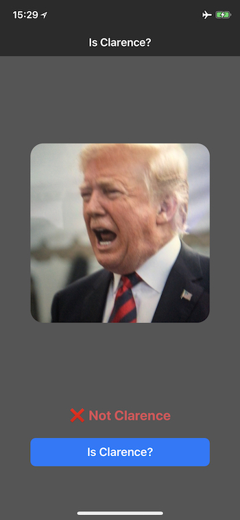

# Is Clarence?

Is Clarence? is a simple iOS app written in Swift 4.2. The app is used to decide whether the person in the taken photo is Clarence or not. The CoreML model was created and trained by using the newly released CreateML tool that ships with Xcode 10 (still in beta).

This app also uses [CoreMLHelpers](https://github.com/hollance/CoreMLHelpers). You can find the license information in LICENSE.txt.
